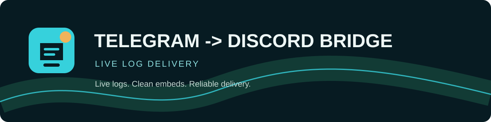

# Telegram -> Discord Bridge



A small Telegram-to-Discord bridge for Majestic RolePlay logs.

It reads messages from `@MajesticRolePlayBot`, extracts useful fields, and forwards them as clean Discord embeds through a webhook. The terminal dashboard uses Rich; no desktop GUI is required.

## Features

- Reads the latest 48 hours during startup
- Watches new Telegram messages live
- Extracts server, character, admin, item, price, amount, and duration details
- Sends normal Discord embeds with category colors and optional branding banner
- Pings one Discord user for `strafe erhalten`, `ban`, `bann`, `sperrung`, or `warn`
- Saves delivered message hashes in SQLite to prevent resend after restart
- Retries failed webhook deliveries
- Rich terminal dashboard

## Setup

1. Create a Telegram API application at [my.telegram.org](https://my.telegram.org).
2. Copy `.env.example` to `.env`.
3. Fill in the Telegram credentials and Discord webhook URL.
4. Set `DISCORD_USER_ID` if penalty alerts should ping a user.
5. Set `DISCORD_BANNER_URL` to a public HTTPS image URL to show a banner on every embed.
6. Set `DISCORD_AVATAR_URL` to a public HTTPS image URL for the webhook avatar.
7. Install dependencies and start the bridge:

```powershell
python -m pip install -r requirements.txt
python main.py
```

The first user-account login may ask for a Telegram code. Keep the generated `.session` file private. Runtime events are printed as simple CLI log lines.

## Configuration

| Variable | Purpose |
| --- | --- |
| `TG_API_ID` / `TG_API_HASH` | Telegram API credentials |
| `TG_PHONE` | Telegram user login phone |
| `TG_BOT_TOKEN` | Optional bot token instead of user login |
| `TG_SOURCE_ID` | Telegram username or chat ID |
| `DISCORD_WEBHOOK_URL` | Destination Discord webhook |
| `DISCORD_USER_ID` | User to ping for serious penalties |
| `DISCORD_BANNER_URL` | Optional public HTTPS banner image |
| `DISCORD_AVATAR_URL` | Optional public HTTPS webhook avatar image |

Never commit `.env`, Telegram sessions, databases, or webhook tokens.

## Docker

```powershell
docker build -t majestic-log-bridge .
docker run --env-file .env majestic-log-bridge
```

For Docker, use a Telegram bot token or provide a session through a secure mounted volume. Do not bake credentials into the image.

## License

This project is licensed under the [MIT License](LICENSE).

See [CONTRIBUTING.md](CONTRIBUTING.md) for development guidelines and [SECURITY.md](SECURITY.md) for reporting security issues.
